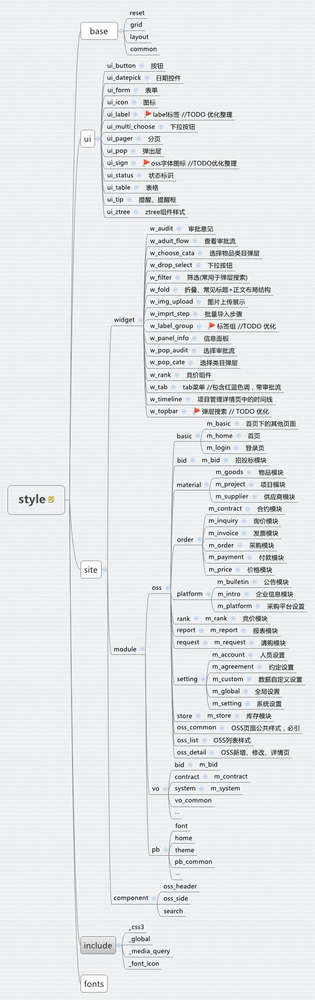

### CSS库结构




### 样式引入说明

`base` > `compontent` > `ui` > `widget` > `module`

#### 说明
- `base`:网站核心基础样式，所有应用共用，不能随意修改。  
- `compontent`:网站结构类样式，如头部、导航、底部、分页等。
- `ui`：网站全局公共样式，如按钮、提示等。所有应用共用，不能随意修改。
- `widget`：网站业务组件类样式，如审批流、tab菜单等。
- `module`：网站业务模块样式，分为`OSS`、`VO`和`PB`三大应用，分别对应`采购商管理平台`,`供应商管理平台`和`采购商首页`。一般维护，只需对module内文件进行增改

#### OSS模块

- `oss_common`: OSS全局公共样式，不可随意添加修改，必引。
- `oss_list`: OSS列表页公共样式，不可随意添加修改，列表页必引。
- `oss_detail`: OSS详情页(包含新增/修改/审批页)公告样式，不可随意添加修改，详情页必引。

**示例**
```
<!-- OSS列表页 -->
<link rel="stylesheet" type="text/css" href="style/site/module/oss/oss_common.css">
<link rel="stylesheet" type="text/css" href="style/site/module/oss/oss_list.css">

<!-- 如需特殊处理，在module文件夹下新建对应的模块并引入 -->
<link rel="stylesheet" type="text/css" href="style/site/module/oss/bid/m_bid.css">
```

```
<!-- OSS详情页页 -->
<link rel="stylesheet" type="text/css" href="style/site/module/oss/oss_common.css">
<link rel="stylesheet" type="text/css" href="style/site/module/oss/oss_detail.css">

<!-- 如需单独处理，在module文件夹下新建对应的模块并引入 -->
<link rel="stylesheet" type="text/css" href="style/site/module/oss/bid/m_bid.css">
```


#### VO模块

> TODO


#### PB模块

> TODO
